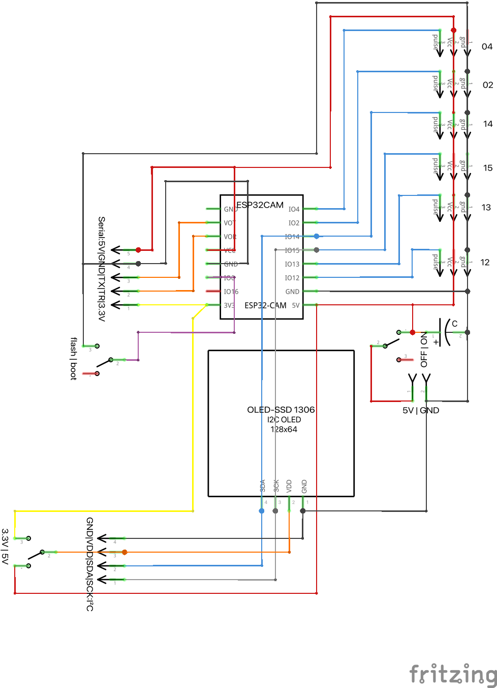
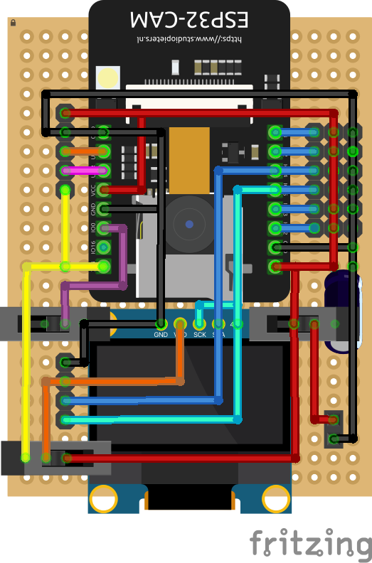

# 🔌 Hardware-Übersicht

Eine Übersicht der empfohlenen Komponenten für das ESP32-Cockpit-Projekt.

- Mechanische Komponenten
- Elektische Komponenten

## 🦿Mechanische Komponenten

3D-Druck-Modelle:
- Zahnrad-Adapter für Servos (16 Zähne)
- Rahmen für Servos
- Rahmen für Platine & Batterieträger

## ⧆ Schaltung

Schaltplan:

Platine:

## 📦 Komponenten

### 📸 ESP32-CAM Modul

- ESP32-CAM mit OV2640 Kamera [(AliExpress)](https://s.click.aliexpress.com/e/_oBq8ZA8)

### 🛞 Servos (PWM)

- Kontinuierlich Rotierende MG90S Servos [(AliExpress)](https://s.click.aliexpress.com/e/_omFREx6)
- 180° SG90 9G Servos [(AliExpress)](https://s.click.aliexpress.com/e/_oFtIuKC)

### ⚡ Spannungsversorgung

- 4xAA Batterieträger[(AliExpress)](https://s.click.aliexpress.com/e/_okNYJQU)

### 🖥 OLED-Display

- SSD1306 OLED [(AliExpress)](https://s.click.aliexpress.com/e/_oEAiIWY)

### 📟 Platine

- DIY-Perfboard 50mm x 70 mm [(AliExpress)](https://s.click.aliexpress.com/e/_omD6h56)

### 🔧 Sonstiges

- PinHeader [(AliExpress)](https://s.click.aliexpress.com/e/_oCZTEzm)
- Lötzinn [(AliExpress)](https://s.click.aliexpress.com/e/_opB63lS)
- Schalter [(AliExpress)](https://s.click.aliexpress.com/e/_o2cnNJq)
- Lötkolben [(AliExpress)](https://s.click.aliexpress.com/e/_ooFZkvO)

> Für detaillierte Anschlusspläne siehe [Schaltplan.pdf](../docs/schaltplan.pdf) (⏳ in Arbeit).