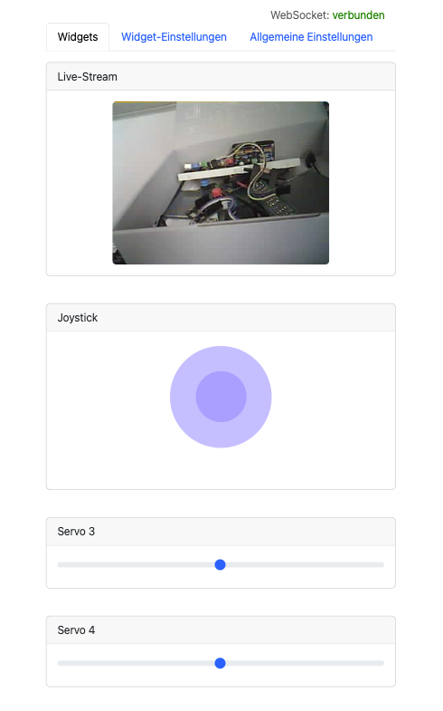
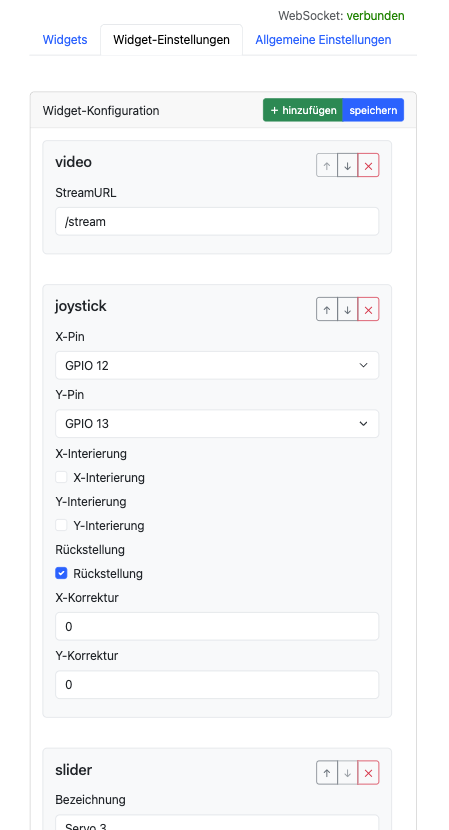
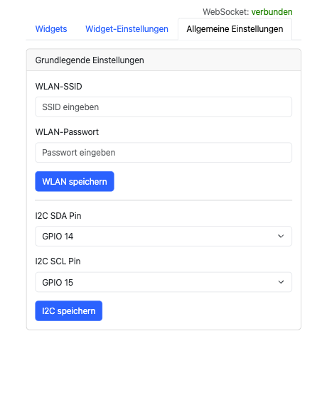

Ein lokal betriebenes, modular konfigurierbares Steuer-Cockpit für ESP32-basierte Technikmodelle – Webinterface inklusive Kamera-Stream, Joysticks, Sensoren und mehr.

# ESP32-Cockpit für Technikmodelle

## 🎯 Vision & Ziel

**Vision:**  
Das *ESP32-Cockpit* soll eine flexible, benutzerfreundliche und erweiterbare Plattform zur Fernsteuerung und Visualisierung mechatronischer Modelle bieten – vollständig lokal betrieben, ohne Cloud-Abhängigkeit, und offen für individuelle Erweiterungen.

**Ziel:**  
Ziel des Projekts ist es, eine konfigurierbare Open-Source-Lösung zu schaffen, mit der sich unterschiedlichste Technik- oder Robotikmodelle intuitiv über ein Webinterface steuern lassen – **ohne den Code auf dem Mikrocontroller bei einem Modellwechsel anpassen zu müssen**. Statt fester Hardware-Logik ermöglicht das Cockpit eine **dynamische Zuweisung von Steuerkomponenten wie Joysticks, Schiebereglern oder Sensoren** per Weboberfläche.

Dadurch wird es möglich, die gleiche Steuereinheit flexibel zwischen verschiedenen Modellen zu verwenden – z. B. von einem Roboterarm zu einem Fahrzeug oder Kran – **ohne Neu-Flashen, Re-Deployment oder Codeänderung**.

Die Plattform dient dabei auch als:

- **Lernumgebung** für Embedded- und Webentwicklung,
- **Basis für modulare Hardwareprojekte** (auch jenseits von LEGO®-Kompatibilität),
- Ausgangspunkt für eine **Community-getriebene Weiterentwicklung**,
- Mittel zur Wahrung der **Datensouveränität** durch rein lokale Datenverarbeitung,
- und Framework für die **Integration von I²C-Sensorik, Servos und Displays**.

---

## 🔧 Features

- 📡 Eigenständiger WiFi Access Point mit Webinterface
- 🎥 Live-Kamera-Streaming via OV2640 (für ESP32-CAM)
- 🪟 Konfigurierbare Widgets: 
  - 🎥 VideoStream,
  - 🕹️ Joystick,
  - 🎚️ Slider,
  - 🔘 Button, (⏳ WIP)
  - 📴 Switches &  (⏳ WIP)
  - 🌡️ Sensoren (⏳ WIP)
- ⚙️ Steuerung von Servos mittels PWM
- 🖥 Anzeige via SSD1306 OLED-Display (via I2C)
- 🔌 Erweiterbar für I²C-Geräte (z. B. Sensoren) (⏳ WIP)

## 👀 Eindrücke

### 🕹️ 1. Dashboard

### 📋 2. Konfiguration
 - hinzufügen/entfernen von Widgets 
 - sortierung der Widgets

### 📋 3. Einstellungen
- WLAN-Einstellungen
- I2C-Verbinungseinstellung

📺 [Demo-Video auf YouTube ansehen](https://www.youtube.com/watch?v=...)

---

## 📟 Supported Devices

- **✅ ESP32-CAM**
- **✅ ESP32-C3**

---

## 🧰 Verwendete Technologien

- **ESP32-CAM** (mit LittleFS, AsyncWebServer, WebSocket)
- **React.js** (Node 20, Tailwind CSS)
- **OV2640** Kamera
- **SSD1306** OLED-Display
- **PlatformIO**, **VSCode**, **Docker** (optional)

---

## 📦 Voraussetzungen

- Docker oder Node.js ≥ 20 (für React-Frontend)
- [PlatformIO](https://platformio.org/)
- ESP32-CAM Modul + Flasher
- Optional: SSD1306 OLED-Display (I²C)

## 🛣️ Roadmap

- [x] Webinterface mit Joystick & Slider
- [x] Kamera-Streaming (ESP32-CAM)
- [x] Speichern & Laden von Konfigurationen
- [x] Anbindung via I²C
- [ ] Sensor-Konfiguration
- [ ] Impletmentierung weiterer I²C-Geräte
- [ ] OTA-Update-Funktion

---

## 🙌 Mitwirken

Pull Requests, Issues und Feature-Vorschläge sind willkommen!

📬 Kontakt: rudolf@beispielmail.de  
💬 Diskussionen: [GitHub Discussions](https://github.com/rswz/lego-controller/discussions)

---

## 📄 Lizenz

Lizenz: Nur für private und nicht-kommerzielle Nutzung.  
Siehe [`LICENSE.md`](./LICENSE.md) für Details.

© 2025 Rudolf Schwarz. Alle Rechte vorbehalten.  
Dieses Projekt befindet sich in aktiver Entwicklung. Community-Mitwirkung ist willkommen!