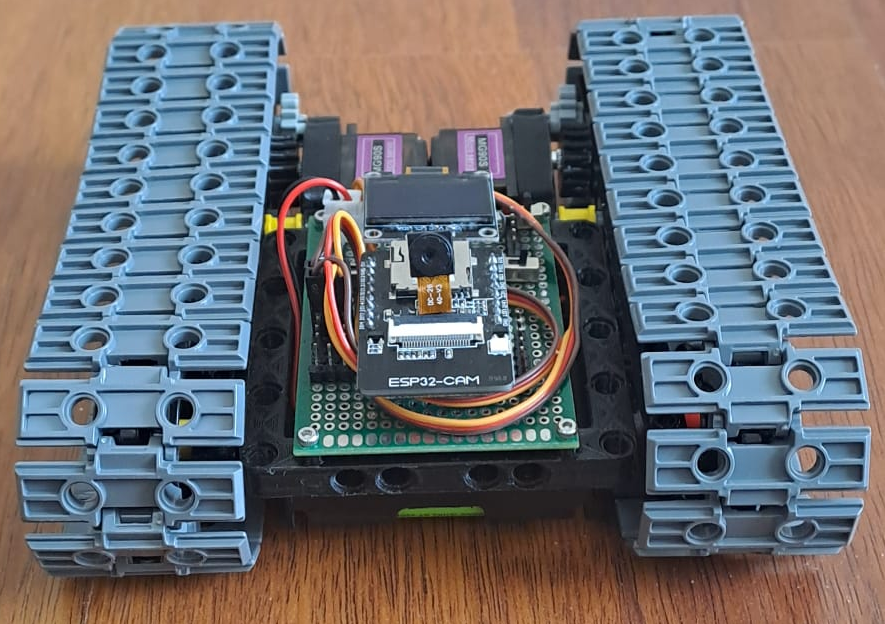

# ESP32-Cockpit für Technikmodelle
Ein lokal betriebenes, modular konfigurierbares Steuer-Cockpit für ESP32-basierte Technikmodelle – Webinterface inklusive Kamera-Stream, Joysticks, Sensoren und mehr.

Beispiel:


## 🎯 Vision & Ziel

**Vision:**  
Das *ESP32-Cockpit* soll eine flexible, benutzerfreundliche und erweiterbare Plattform zur Fernsteuerung und Visualisierung mechatronischer Modelle bieten – vollständig lokal betrieben, ohne Cloud-Abhängigkeit, und offen für individuelle Erweiterungen.

**Ziel:**  
Ziel des Projekts ist es, eine konfigurierbare Open-Source-Lösung zu schaffen, mit der sich unterschiedlichste Technik- oder Robotikmodelle intuitiv über ein Webinterface steuern lassen – **ohne den Code auf dem Mikrocontroller bei einem Modellwechsel anpassen zu müssen**. Statt fester Hardware-Logik ermöglicht das Cockpit eine **dynamische Zuweisung von Steuerkomponenten wie Joysticks, Schiebereglern oder Sensoren** per Weboberfläche.

Dadurch wird es möglich, die gleiche Steuereinheit flexibel zwischen verschiedenen Modellen zu verwenden – z. B. von einem Roboterarm zu einem Fahrzeug oder Kran – **ohne Neu-Flashen, Re-Deployment oder Codeänderung**.

Die Plattform dient dabei auch als:

- **Lernumgebung** für Embedded- und Webentwicklung,
- **Basis für modulare Hardwareprojekte** (auch jenseits von LEGO®-Kompatibilität),
- Ausgangspunkt für eine **Community-getriebene Weiterentwicklung**,
- Mittel zur Wahrung der **Datensouveränität** durch rein lokale Datenverarbeitung,
- und Framework für die **Integration von I²C-Sensorik, Servos und Displays**.

---

## 🔧 Features

- 📡 Eigenständiger WiFi Access Point mit Webinterface
- 🎥 Live-Kamera-Streaming via OV2640 (für ESP32-CAM)
- 🪟 Konfigurierbare Widgets: 
  - 🎥 VideoStream,
  - 🕹️ Joystick,
  - 🎚️ Slider,
  - 🔘 Button, (⏳ WIP)
  - 📴 Switches &  (⏳ WIP)
  - 🌡️ Sensoren (⏳ WIP)
- ⚙️ Steuerung von Servos mittels PWM
- 🖥 Anzeige via SSD1306 OLED-Display (via I2C)
- 🔌 Erweiterbar für I²C-Geräte (z. B. Sensoren) (⏳ WIP)
---
## 👀 Vorschau

#### 🕹️ 1. Dashboard


#### 📋 2. Konfiguration
 - hinzufügen/entfernen von Widgets 
 - sortierung der Widgets


#### 📋 3. Einstellungen
- WLAN-Einstellungen
- I2C-Verbinungseinstellung


📺 [Demo-Video auf YouTube ansehen](https://www.youtube.com/watch?v=...)

---

## 📟 Hardware

- [✅ ESP32-CAM](docs/esp32cam/hardware.md)
- **⏳ ESP32-C3**

👉 [Zur Hardware-Übersicht](docs/esp32cam/hardware.md)

---

## 🧰 Software

- **React.js** (Node 20, Tailwind CSS)
- **PlatformIO**
- **VSCode**
- **Docker** (optional)

---

## 🛠️ Projekt-Build mit Makefile

Das Projekt nutzt ein Makefile zur einfachen Steuerung von Build-, Upload- und Entwicklungsprozessen.

### 🔃 Häufig genutzte Befehle

```bash
make build           # Firmware kompilieren (PlatformIO)
make upload          # Firmware auf ESP32-CAM flashen
make uploadfs        # Webinterface-Dateien auf ESP32-CAM hochladen
make monitor         # Serielle Ausgabe überwachen
make build-ui        # Frontend bauen (React → firmware/data)
make install-server  # Node-Module installieren (in Docker)
make start-server    # Lokalen Webserver starten (Docker, Port 3000)
```

> Hinweis: `uploadfs` führt automatisch `build-ui` aus und überträgt dann das Webinterface auf das Gerät.
---
## 🛣️ Roadmap

- [x] Webinterface mit Joystick & Slider
- [x] Kamera-Streaming (ESP32-CAM)
- [x] Speichern & Laden von Konfigurationen
- [x] Anbindung via I²C
- [ ] Sensor-Konfiguration
- [ ] Impletmentierung weiterer I²C-Geräte
- [ ] OTA-Update-Funktion

---
## 🤝 Support

Wenn dir dieses Projekt gefällt, kannst du es unterstützen oder in den sozialen Medien verfolgen:

- [Buy Me a Coffee](https://www.buymeacoffee.com/engineerreindeer)
- [Patreon](https://www.patreon.com/engineerreindeer)
- [YouTube](https://www.youtube.com/@rusedus)
- [GitHub](https://github.com/rswz/lego-controller)
---

## 🙌 Mitwirken

Pull Requests, Issues und Feature-Vorschläge sind willkommen!

📬 Kontakt: rudolf.schwarz@rusedus.de  
💬 Diskussionen: [GitHub Discussions](https://github.com/rswz/lego-controller/discussions)

---

## 📄 Lizenz

Lizenz: Nur für private und nicht-kommerzielle Nutzung.  
Siehe [`LICENSE.md`](./LICENSE.md) für Details.

© 2025 Rudolf Schwarz. Alle Rechte vorbehalten.  
Dieses Projekt befindet sich in aktiver Entwicklung. Community-Mitwirkung ist willkommen!